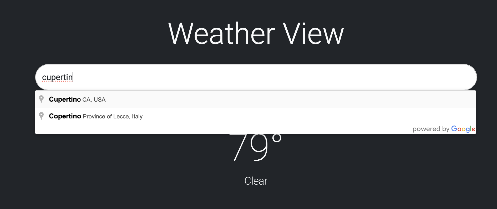
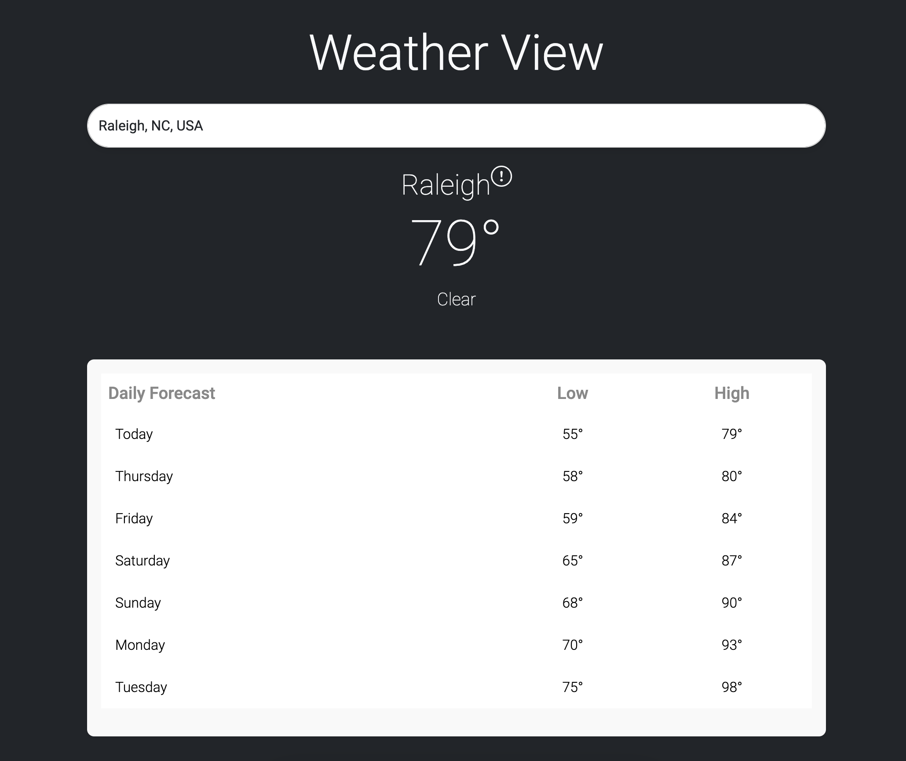
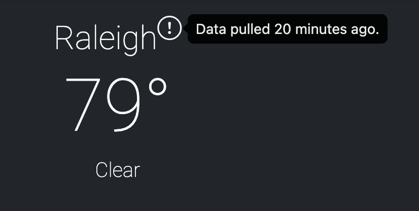

# Weather View

This repository contains a weather application built with Ruby on Rails and React. It fetches weather data based on latitude and longitude coordinates and displays relevant data to the user.

## Table of Contents

- [Features](#features)
- [Getting Started](#getting-started)
- [Prerequisites](#prerequisites)
- [Installation](#installation)
- [Running the Application](#running-the-application)
- [Running Tests](#running-tests)
- [Built With](#built-with)
- [Design Patterns](#design-patterns)

## Features

### Autocomplete Search

The application uses Google Places API to provide autocompletion.



### Daily Weather Forecast

The application displays weather data retrieved from the free [Open-Meteo API](https://open-meteo.com/), supplied with coordinates from the Google Places API.



### Efficient Data Retrieval

The application stores weather data by coordinates in the cache for 30 minutes, preventing redundant calls to the Open-Meteo API. An icon can be hovered over to display when the data was last retrieved.



## Getting Started

Follow these instructions to get a copy of the project up and running on your local machine.

## Prerequisites

- **Ruby**: 3.0.3
- **Node.js**: 20.16.0
- **Yarn**: 1.22.19
- **PostgreSQL**: Ensure you have PostgreSQL installed and running.

## Installation

1. Clone the repository:

   ```sh
   git clone https://github.com/gabrielestes/weather-app.git
   cd weather-app
   ```

2. Install Ruby dependencies:

   ```sh
   bundle install
   ```

3. Install Node.js dependencies:

   ```sh
   yarn install
   ```

4. Set up the database:

   ```sh
   rails db:create
   rails db:migrate
   ```

5. Set up environment variables:
   - Create a `.env` file in the root directory.
   - Add your Google Maps API key:
     ```
     GOOGLE_MAPS_API_KEY=your_api_key_here
     ```

## Running the Application

Build the CSS and start the server:

```sh
yarn start
```

Visit http://localhost:3000 (or whichever port you've chosen) in your browser to see the application running.

## Running Tests

Run the test suite using RSpec:

```sh
rspec
```

## Built With

Ruby on Rails - Web framework

React - Frontend library

Bootstrap - CSS framework

## Design Patterns

This application implements several design patterns to improve code organization and maintainability:

### Facade Pattern

The WeatherController acts as a facade by providing a simplified interface to interact with the weather data retrieval process.

### Service Object Pattern

The WeatherApi::Client is a service object that encapsulates the logic for interacting with the weather API.

### Caching Pattern

The WeatherController implements the Cache-Aside pattern using Rails caching to store and retrieve weather data, reducing the number of API calls.
